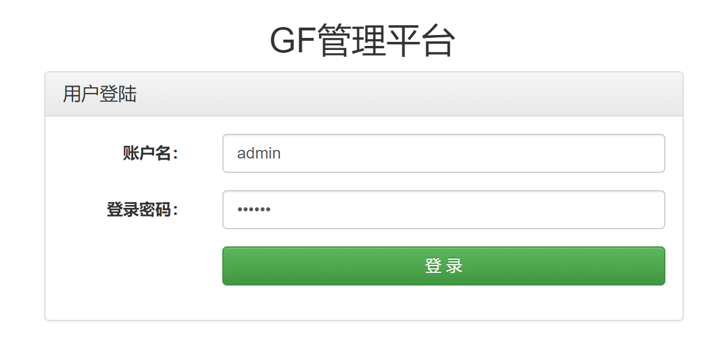
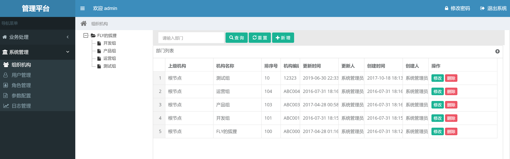
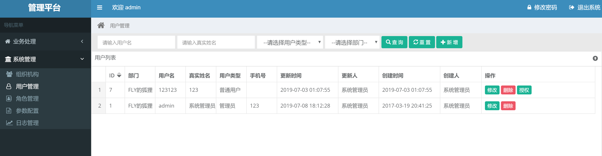
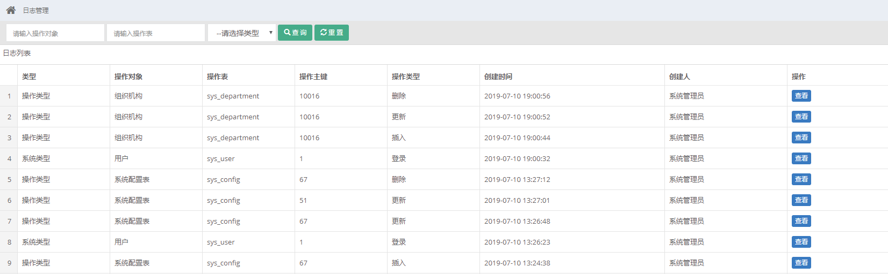
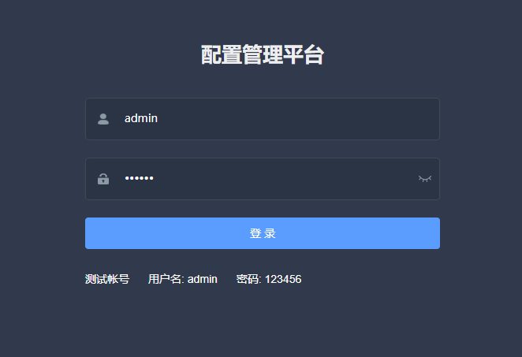
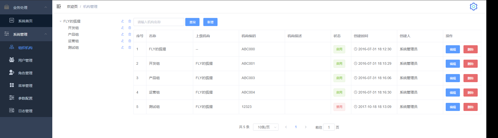
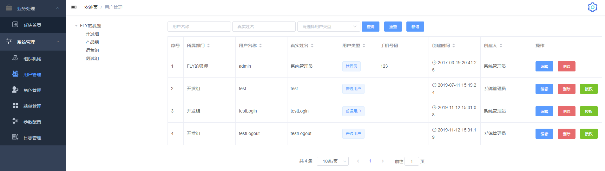
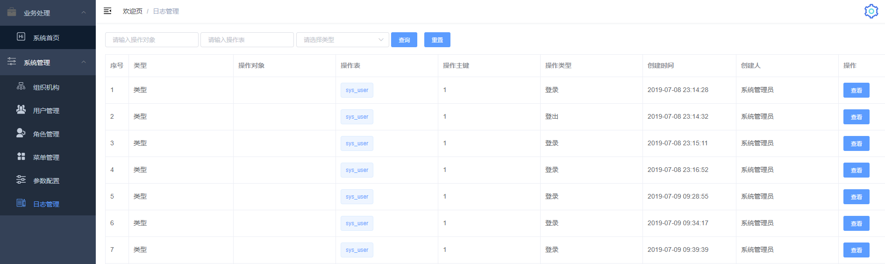

# gmanager

* 基于gf框架的管理后台，支持登录、认证、组织机构、用户帐号、角色权限、菜单、操作日志
* gmanager已全面支持前后端分离，同时也支持服务端模板部署；
* 登录组件使用gtoken完美支持集群部署

## 安装教程
### 代码地址
* github地址：https://github.com/goflyfox/gmanager
* gitee地址：https://gitee.com/goflyfox/gmanager

### 下载部署
1. 从git下载项目： git clone https://github.com/goflyfox/gmanager
2. 安装mysql数据库，创建db，运行deploy下gmanager.sql脚本
3. 修改config下config.toml配置文件
```toml
# 数据库配置
[database]
    link = "root:123456@tcp(127.0.0.1:3306)/gmanager"
```
4. go run main.go
5. 访问http://localhost即可看到登录页面，账号/密码：admin/123456

### 服务端打包
1. 打包可以使用gf提供的gf-cli进行打包
2. 也可通过原始交叉编译命令

打linux环境包
```
SET CGO_ENABLED=0
SET GOOS=linux
SET GOARCH=amd64
go build main.go
```

打本地环境包
```
go build main.go
```

### 前后端分离说明
1. gmanager完全支持前后端分离，前端使用vue-admin-template
2. 前端运行下载github代码，运行`npm install&npm run dev`
3. 具体前端代码及详细部署说明见： [https://github.com/goflyfox/gmanager-web](https://github.com/goflyfox/gmanager-web)
4. 由于前后端分离和服务端模板菜单有所区别，数据库需要运行：gmanager-web.sql
5. 如果有强迫症，使用前后端分离可以把public和template目录里面内容删除，但目录一定要保留；

## 功能模块
1. 登录、认证、登出
2. 组织机构管理
3. 用户管理
4. 角色管理
5. 菜单管理
6. 日志管理
7. 支持登录、登出、业务增删改操作记录
8. 支持接口调用、返回参数打印，便于问题排查

## 代码生成
如需代码生成，请参考java项目：https://gitee.com/jflyfox/AutoCreate

## 平台截图

### 服务端模板截图
登录：


组织机构：


用户管理：


日志管理：


### 前后端分离Vue截图
登录：


组织机构：


用户管理：


日志管理：


## 感谢

1. gf框架 [https://github.com/gogf/gf](https://github.com/gogf/gf) 

## 项目支持

- 项目的发展，离不开大家得支持~！~

- [【双12】主会场 低至1折；请点击这里](https://www.aliyun.com/1212/2019/home?userCode=c4hsn0gc)
- [阿里云：ECS云服务器2折起；请点击这里](https://www.aliyun.com/acts/limit-buy?spm=5176.11544616.khv0c5cu5.1.1d8e23e8XHvEIq&userCode=c4hsn0gc)
- [阿里云：ECS云服务器新人优惠券；请点击这里](https://promotion.aliyun.com/ntms/yunparter/invite.html?userCode=c4hsn0gc)

- 也可以请作者喝一杯咖啡:)


[捐赠列表](deploy/Donate.md)